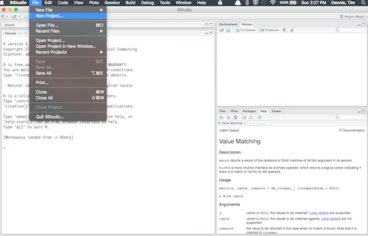
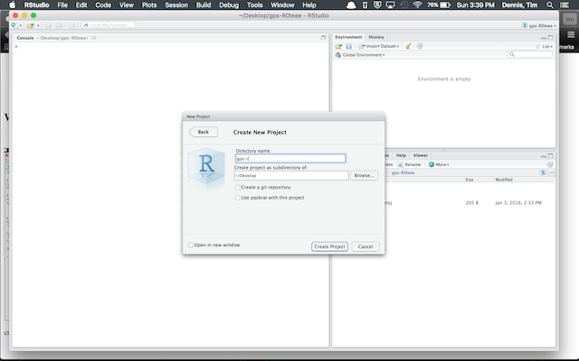

## Create New Poroject in RStudio

1. Open RStudio and go to `File>New Project` in the top menu
2. Select `New Directory`
3. Choose `Empty Project`
4. Type Directory Name, e.g., gps-r or what you want, and navigate where you want this to live (Desktop is usually easy to find)
5. Select 'Create project' and now download the data

## Download gapminder data into the project

We need a data folder inside our project. 

1. Once you create a project above you should be in the project folder and the following will work 
2. In RStudio far lower right pane, select 'Files' 
2. Click 'New Folder' and name 'data'
3. In the console, run (without the >)
> download.file('https://raw.githubusercontent.com/resbaz/r-novice-gapminder-files/master/data/gapminder-FiveYearData.csv', 'data/gapminder-FiveYearData.csv')
4. This will download and place a gapminderFiveYearData.csv inside the data folder 

## With Screenshots

1. Open RStudio and go to `File>New Project>New Project` in the top menu  

2. Select `New Directory > Empty Project`:  

3. Create a new data folder in project folder: 

4. Download gapminder data into data folder: 

Run `download.file('https://raw.githubusercontent.com/resbaz/r-novice-gapminder-files/master/data/gapminder-FiveYearData.csv', 'data/gapminder-FiveYearData.csv')` from console

